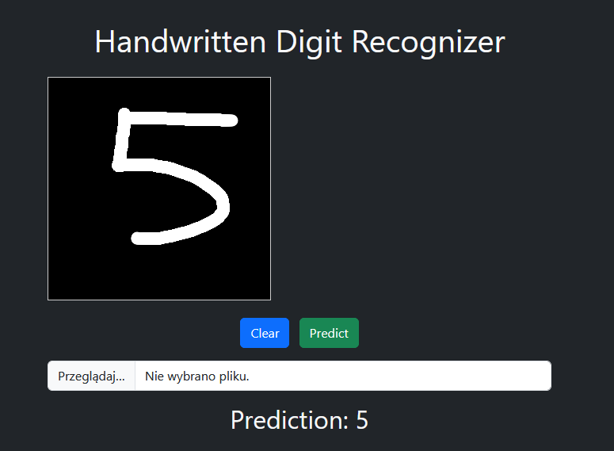

# Handwritten Digit Recognizer

This project is a simple Handwritten Digit Recognizer built with PyTorch and Flask. It trains a neural network on the MNIST dataset and deploys it as a web application where users can draw digits on a canvas and receive real-time predictions and you can upload your own pictures.

## Data

The MNIST dataset is automatically downloaded via torchvision when the project is run, so there is no data folder in the repository. 

  

